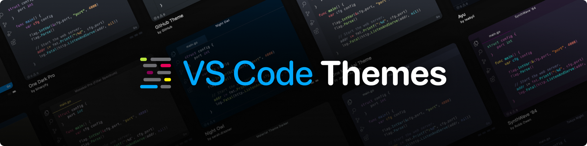

The backend for the [vscodethemes](https://vscodethemes.com) website. Built with [River](https://riverqueue.com/) and [Huma](https://huma.rocks).

## Development

The [Taskfile.yml](./Taskfile.yml) contains a bunch of useful commands for getting started with development. To get started:

1. Generate a new keypair: `task generate-keyset`
2. Generate a new JWT: `task generate-jwt`
3. Start the database: `task db`
4. Run the migrations: `task migrate-up`
5. Start the object storage server: `task objectstore`
6. Start the workers server: `task workers`
7. Start the API server: `task api`
8. Open the API docs: `open http://localhost:8080/docs`

If you are interested in contributing or have any questions, feel free to open an issue.